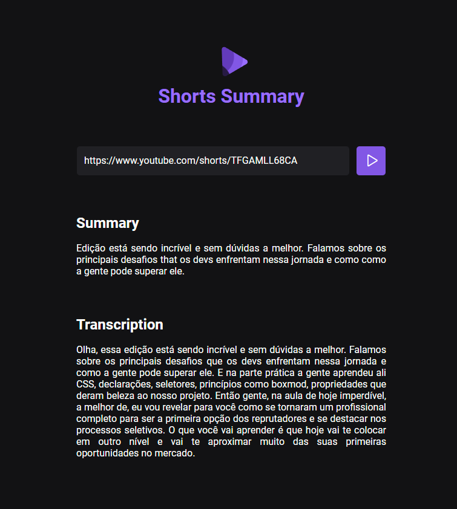

Application built on Rocketseat's NLW AI on the Foundations track.

  <a href="#-technologies">Technologies</a>&nbsp;&nbsp;&nbsp;|&nbsp;&nbsp;&nbsp;
  <a href="#-project">Project</a>&nbsp;&nbsp;&nbsp;|&nbsp;&nbsp;&nbsp;
  <a href="#-license">License</a>
  <a href="#-my-linkedin">LinkedIn</a>

  

 

  

## 🚀 Technologies

This project was developed with the following technologies:

- HTML
- CSS
- JavaScript

## 💻 Project

Shorts Summary is a web application to create a summary of YouTube short videos using Artificial Intelligence to transcribe the video content and summarize the content. This project is developed in the Foundations track in the NLW IA edition.

## 📝 License

This project is under the [MIT]() license. See the LICENSE file for more details.

## 🔎 My LinkedIn

<h3 align="center">Developed by Arthur Lacerda ☕</h3>
